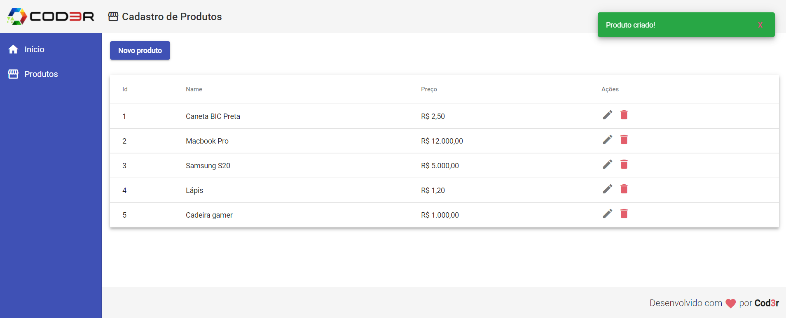

<div align="center">
  <h1>CRUD application with Angular</h1>
  
  
  
</div>

## The project

Web application to implement a CRUD (create-read-update-delete) of products with Angular 9 framework.

Developed during the "Angular 9 Essencial" course at [Cod3r](https://www.cod3r.com.br).

<div align="center">
  
</div>

---

## Technologies and tools

- Angular 9
- Typescript

---

## How to run the project?

Before start, install [Git](https://git-scm.com), [Node.js](https://nodejs.org/en/) and [Npm](https://docs.npmjs.com/downloading-and-installing-node-js-and-npm) on your machine. Moreover, recommend use the [VSCode](https://code.visualstudio.com/) terminal.

```bash
# Clone this repository
$ git clone https://github.com/cunhasbia/angular-crud.git
$ cd angular-crud

# Run the fake server/backend
$ cd backend
$ npm install
$ npm start

# Run the frontend project
$ cd frontend
$ npm install
$ npm start

# The app will be running on your browser at http://localhost:4200
```
Need help? Failed to run? Feel free to contact me.

---
<p align="center">Made with :orange_heart: by Bianca Cunha | Find me on <a href="https://www.linkedin.com/in/biancascunha">LinkedIn</a></p>